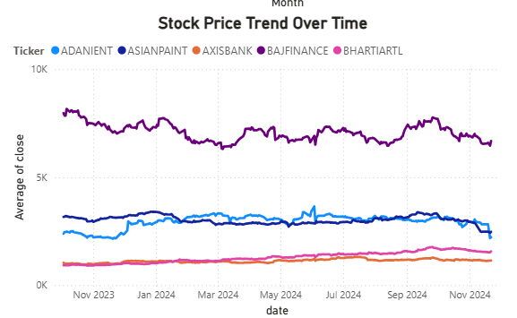
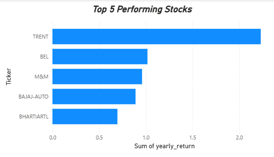
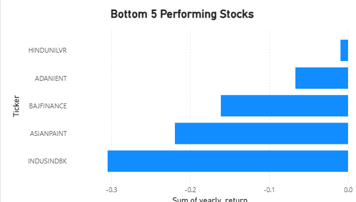

# Stock Market Performance Analysis

## Project Overview
This project analyzes stock market data to identify trends, sector performance, and volatility patterns using Python and Power BI.

## Tools Used
- Python
- Pandas
- Matplotlib
- Power BI
- Streamlit

## Project Structure

stock-market-performance-analysis
│
├── Data
├── Images
├── Notebooks
├── Power BI
├── scripts

## Dashboard Preview

## Key Insights
- Identified top and bottom performing stocks
- Analyzed monthly stock price trends
- Compared sector performance
- Evaluated volatility patterns

## Author
Shrinidhi Seshan